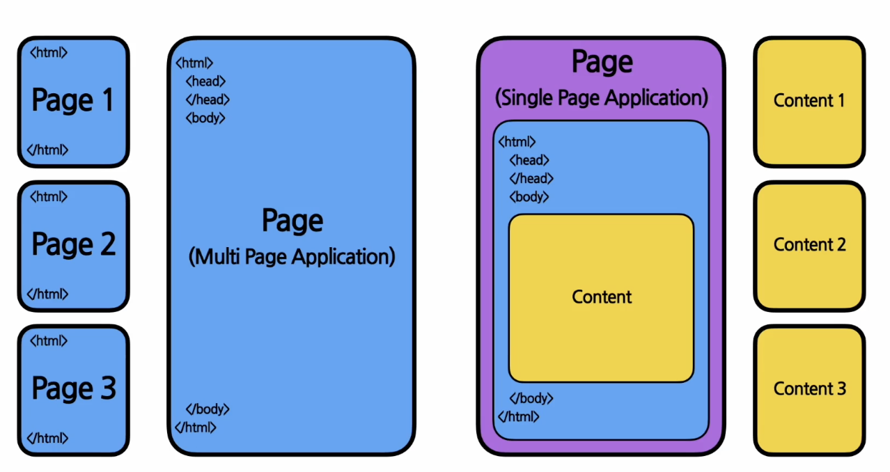

# 0강. 준비하기
## 1. HTML과 CSS
### 1.1. HTML(Hyper Text Markup Language) 이란?
웹사이트의 뼈대를 구성하기 위해 사용하는 마크업 언어의 한 종류. 
### 1.2. HTML의 태그
```html
<html> // html의 시작과 끝을 알리는 태그
    <head> 
        // 머리를 담당하는 태그. 웹사이트의 속성이 들어감. 웹사이트가 어떤 웹사이트인지 제목, 속성 등을 담고 있으 이러한 데이터를 메타 데이터라고 함.
    </head> 
    <body>
        // 헤드 태그 다음에 나오며 몸통을 담당하는 태그. 실제로 웹사이트에서 보이는 컨텐츠가 들어옴. 즉, 우리가 실제로 웹사이트에서 보는 내용이 들어옴.
    </body>
</html>
```
- 괄호 여는 것으로 시작해 닫는 것으로 구성됨 (ex. `<html>` `</html>`)
- 각 페이지 별로 html 파일이 존재하며 페이지를 따로 이동하게 될 경우, 브라우저에서는 해당 페이지의 html 파일을 받아와서 화면에 표시해 줌. 

### 1.3. SPA (Single Page Application)
하나의 페이지만 존재하는 웹사이트/웹 애플리케이션. 
