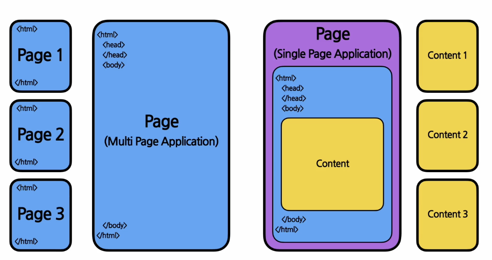

# 0강. 준비하기
## 1. HTML과 CSS
### 1.1. HTML(Hyper Text Markup Language) 이란?
___
웹사이트의 뼈대를 구성하기 위해 사용하는 마크업 언어의 한 종류. 
### 1.2. HTML의 태그
___
```html
<html> // html의 시작과 끝을 알리는 태그
    <head> 
        // 머리를 담당하는 태그. 웹사이트의 속성이 들어감. 웹사이트가 어떤 웹사이트인지 제목, 속성 등을 담고 있으 이러한 데이터를 메타 데이터라고 함.
    </head> 
    <body>
        // 헤드 태그 다음에 나오며 몸통을 담당하는 태그. 실제로 웹사이트에서 보이는 컨텐츠가 들어옴. 즉, 우리가 실제로 웹사이트에서 보는 내용이 들어옴.
    </body>
</html>
```
- 괄호 여는 것으로 시작해 닫는 것으로 구성됨 (ex. `<html>` `</html>`)
- 각 페이지 별로 html 파일이 존재하며 페이지를 따로 이동하게 될 경우, 브라우저에서는 해당 페이지의 html 파일을 받아와서 화면에 표시해 줌. 

### 1.3. SPA(Single Page Application)

___
<p>

</p>
하나의 페이지만 존재하는 웹사이트/웹 애플리케이션. 

### 1.4. CSS(Cascading Style Sheets) 란?
___
웹사이트의 레이아웃과 글꼴, 색상 등의 디자인을 입히는 역할을 하는 언어

:heavy_exclamation_mark: HTML vs CSS cs JavaScript 
- HTML : 웹사이트의 구조
- CSS : 웹사이트에 디자인 입히기
- JavaScript : 동적인 작업 처리
<br>
*HTML과 JavaScript는 성격 자체가 다름. HTML은 뼈대, 자바스크립트는 생명 불어넣기.

## 2. JavaScript
### 2.1. JavaScript 란?
***
JavaScript는 동적인 작업 처리를 하며 스크립트 언어의 한 종류임.
*스크립트 언어의 특징
프로그램이 실행되는 런타임에 코드가 해석됨. 컴파일 언어는 컴파일이라는 과정을 통해 소스코드가 해석되고 실행 가능한 형태로 변환됨. 스크립트 언어는 런타임의 코드가 해석되고 실행됨… + 사용 범위가 굉장히 넓음.
### 2.2. JavaScript 자료형(Data Type)
***
변수를 선언할 때가 아닌 변수의 데이터가 대입되는 시점에 해당 변수의 자료형이 결정됨. 이처럼 동적으로 자료형이 결정되는 것을 <b>동적 타이핑(Dynamic Typing)</b>이라고 함. 자바스크립트는 이 동적 타이핑 방식을 사용함. 
### 2.3. var과 let 방식의 차이점
***
### 2.4. 연산자 (Operators)
***
#### 2.4.1. 대입연산자 (Assignment Operators)
*** 
변수의 값을 대입하기 위해 사용하는 연산자.
대입 연산자는 항상 오른쪽에서 왼쪽 방향으로 흘러감.
#### 2.4.2. 산술 연산자 (Arithmetic Operators)
***
사칙연산자 (덧셈.뺄셈.곱셈.나눗셈.)나눗셈의 나머지 구하는 연산자, 지수 연산자(**)를 통칭해서 부르는 명칭
#### 2.4.3. 증감연산자(++), 감소연산자(--)
***
- postfix 방식 : a++
- prefix 방식 : ++a
#### 2.4.4. 관계 연산자 (Relational Operators)
***
변수들 사이의 관계를 비교하기 위해서 사용하기 때문에 비교 연산자라고도 부름. 
*비교 연산자 (Comparison Operators) : 말 그대로 변수들의 값을 비교하기 위해 사용함. (ex. `<`, `>`, `<=`, `>=` )
#### 2.4.5. 동등 연산자 (Equality Operators)
***
두 개의 변수의 값이 같은지 다른지를 판단할 수 있게 해줌. 같은 지 다른지 비교하기 위해 `==` 과 `!=`을 이용함. 
#### 2.4.6. 일치 연산자 (Strict Equality Operators)
***
자바스크립트에서는 단순히 동등한 지 비교하는 것 외에도 변수의 자료형까지 같은지 엄격하게 비교하기 위해 사용.
`===`, `!==` : 값은 같지만 자료형이 다를 경우, false임. 
#### 2.4.7. 이진 논리 연산자 (Binary Logical Operators)
***
true와 false값만을 가지는 분리형 값을 비교할 때 사용하는 연산자. 
`&&` : a와 b가 모두 true일 경우에만 true
`||` : a 또는 b가 true일 경우 true
#### 2.4.8. 삼항 연산자 (Ternary Operators)
***
`조건식 ? true일 경우 : false 일 경우`
### 2.5. 자바스크립트 함수
***
프로그래밍에서 함수란 입력을 받아서 정해진 출력을 하는 것. 
여기서 함수의 입력을 파라미터(parameters)/인자(arguments)라고 부름.
> 자바스크립트에서 함수를 정의하는 방법은 크게 두 가지. <br> 1. function statement 사용 <br> 2. arrow function expression 사용
### 2.6. 개발환경 설정하기
***
- Node.js (JavaScript runtime)
자바스크립트로 네트워크 애플리케이션을 개발할 수 있게 해주는 환경.
- npm (node package manage)
Node.js를 위한 패키지 매니저.
패키지 매니저가 하는 역할은 프로젝트에서 필요로 하는 다양한 외부 패키지들의 버전과 의존성을 관리하고 편리하게 설치 및 삭제를 할 수 있도록 도와주는 것.
```
$ node --version
$ npm --version
```