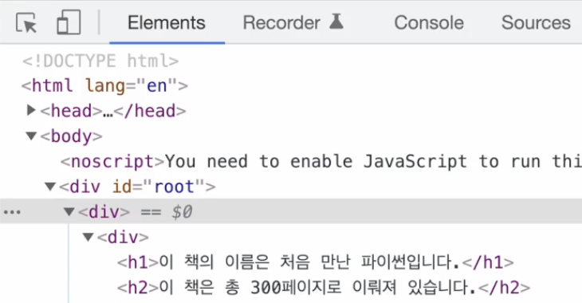
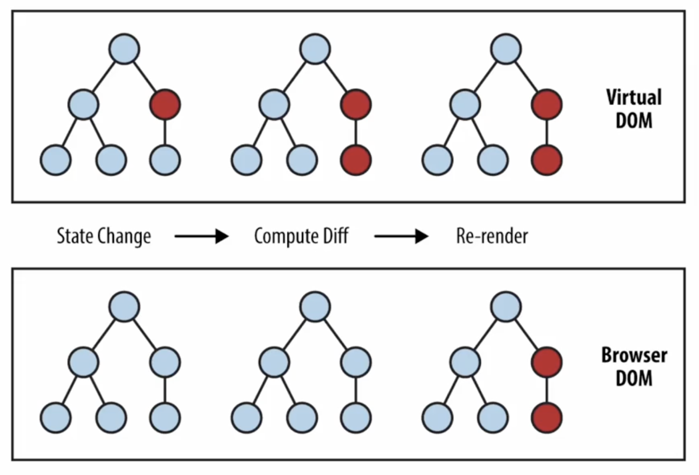
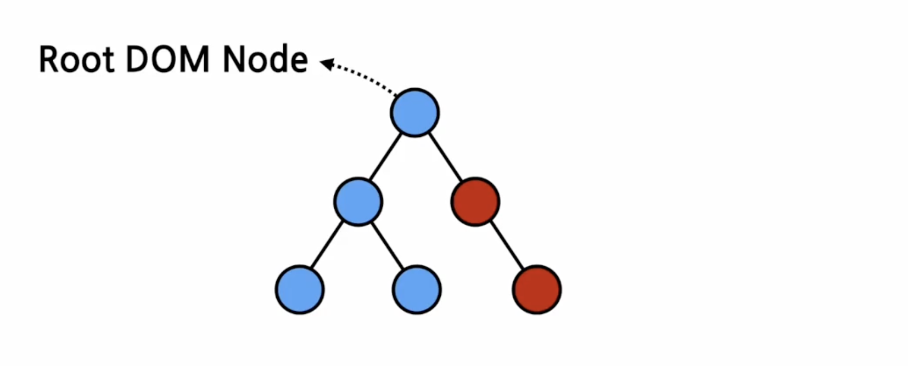

# 4강. Rendering Elements
<br>

*createElement 함수 : 엘리먼트를 생성해주는 함수
엘리먼트 개념.역할.랜더링되는 과정
<br><br>

## Elements 란?
어떤 물체를 구성하는 성분
> Elements are the smallest building blocks of React apps. 
<br> 엘리먼트는 리액트 앱을 구성하는 가장 작은 블록들

*엘리먼트는 원래 웹사이트에 대한 모든 정보를 담고 있는 객체인 DOM에서 사용하는 용어. 기존에는 엘리먼트라고 하면 DOM 엘리먼트를 의미했음.


개발자 모드에서의 Elements는 DOM Elements를 의미함. <br><br>

## React Elements vs DOM Elements
화면에 나타나는 내용을 기술하는 자바스크립트 객체를 일컫는 용어로, descriptor를 사용했으나 이가 최종으로 나타나는 형태는 DOM Elements였기에 DOM과의 통일성을 주기 위해 명칭을 엘리먼트로 바꿈. 


<br>
Thus, React Element는 DOM Element의 가상 표현.<br>
DOM Element는 React Element에 비해 많은 정보를 담고 있기 때문에 상대적으로 크고 무거움. 
<br><br>

## React Elements
화면에서 보이는 것을 기술함. 리액트 엘리먼트가 기술한 내용을 토대로 실제 우리가 화면에서 보게 되는 DOM 엘리먼트가 만들어짐. 
<br>

```JSX
const element = <h1> Hello, world </h1>
// 대입 연산자의 왼쪽 부분이 엘리먼트..
// 이 코드가 실행될 때 대입 연산자의 오른쪽 부분은 React의 createElement 함수를 사용하여 엘리먼트를 생성하게 됨. 
// 이렇게 생성된 것이 React의 Element가 됨.
// 리액트는 이 엘리먼트를 이용해서 실제 우리가 화면에서 보게 될 DOM 엘리먼트를 생성함. 
```
<br><br>

## React Elements 생김새
리액트 엘리먼트는 <b>자바스크립트 객체 형태로 존재함</b>. 이 객체를 만드는 역할을 하는 것은 createElement 함수. createElement 함수 호출 시 3가지 parameter를 넣음. 
<br>

```Javascript
React.createElement(
    type,
    [props],
    [...children]
)
```
<br>

1. type<br>
2. props <br>
*props는 attributes보다는 좀 더 상위에 있는 복잡한 개념. 
3. children <br>
*해당 엘리먼트의 자식 엘리먼트들이 들어감... <br>

리액트 엘리먼트는 컴포넌트 유형과 속성 및 내부의 모든 자식에 대한 정보를 포함하고 있는 일반적인 자바스크립트 객체. 
<br> 이 객체는 마음대로 변경할 수 없는 불변성을 갖고 있음. 
<br><br>

## React Elements 특징
> React elements are immutable (불변성)
<br> Thus, 엘리먼트가 불변성을 갖고 있다는 것은 한 번 생성된 엘리먼트는 변하지 않는다는 것. => <b>엘리먼트 생성 후에는</b> children이나 attributes를 바꿀 수 X.

Then, 화면에 변경된 엘리먼트들을 보여주기 위한 방법은? 기존 엘리먼트를 변겅하는 것이 아니라 새로운 엘리먼트를 만들어 기존 엘리먼트와 바꿔치기 하면 됨. 
<br>

화면에 새로운 내용을 보여주기 위해서 Virtual DOM은 변경된 부분을 계산, 컴퓨터 딥하고 해당 부분만을 다시 렌더링. 
<br>

```JavaScript
<div id="root"></div>
// div 태그 안에 리액트 엘리먼트들이 렌더링 되며 이것을 루트 돔노드라고 함. 
// div 태그 안에 있는 모든 것이 리액트 돔에 의해서 관리됨.
// 오직 리액트만으로 만들어진 모든 웹사이트들은 단 하나의 루트 돔노드를 가지게 됨. <br> but 기존 웹사이트에 추가적으로 리액트 연동 시, 여러 개의 분리된 수많은 루트 돔노드를 가질 수 있음. 
```
<br>


<br>

```JavaScript
// 엘리먼트를 하나 생성하고 생성된 엘리먼트를 루트 DIV에 렌더링하는 코드.
// 렌더링을 위해 리액트 돔에 렌더라는 함수 사용.
// 이 함수는 첫 번째 파라미터인 react element를, 두 번째 파라미터인 html element 즉, DOM element에 렌더링하는 역할을 함. 
// react element는 react의 virtual DOM에 존재하고 DOM element는 실제 브라우저의 DOM에 존재하는 것. 
const element = <h1> 안녕, 리액트! </h1>
ReactDOM.render(element, document.getElementById('root')); 
```
<br><br>

## 한 번 렌더링된 Elements 업데이트하기
불변성으로 인해 업데이트하기 위해서는 다시 생성해야 함. 
<br><br>

## 실습. 시계 만들기
<br>

```JavaScript
// Clock.jsx

import React from 'react'

function Clock(props) {
  return (
    <div>
      <h1>안녕, 리액트!</h1>
      <h2> 현재 시간 : {new Date().toLocaleTimeString()}</h2>
    </div>
  )
}

export default Clock;

```
```JavaScript
//index.js

import React from 'react';
import ReactDOM from 'react-dom/client';
import './index.css';
import App from './App';
import reportWebVitals from './reportWebVitals';

import Clock from './4강/Clock';

const root = ReactDOM.createRoot(document.getElementById('root'));
setInterval(() => {
  root.render(
    <React.StrictMode>
      <Clock />
    </React.StrictMode>
  );
}, 1000);


// If you want to start measuring performance in your app, pass a function
// to log results (for example: reportWebVitals(console.log))
// or send to an analytics endpoint. Learn more: https://bit.ly/CRA-vitals
reportWebVitals();

```