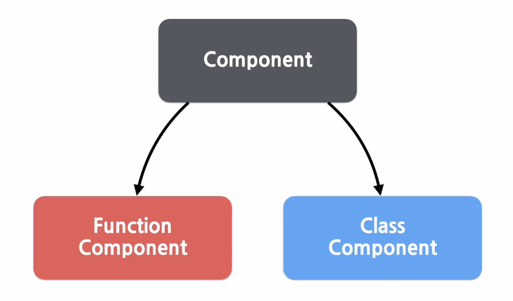

# 5강. Components and Props
<br>

<h3>복습</h3>
<br>

> 리액트는 컴포넌트 기반의 구조라는 특징이 있음. 
리엑트에서는 모든 페이지가 컴포넌트로 구성되어 있고 하나의 컴포넌트는 또 다른 여러 개의 컴포넌트의 조합으로 구성될 수 있음. 
<br><br>

##  
리액트 컴포넌트에서의 입력은 props라는 것이고, 출력은 React element가 됨. <br>=> React component가 해주는 역할은 어떠한 속성들을 입력으로 받아서 그에 맞는 React element를 생성하여 리턴해주는 것. <br>React Component는 만들고자 하는 대로 props(속성)을 넣으면 해당 속성에 맞춰 화면에 나타날 엘리먼트를 만들어주는 것. 


*React element = 리액트 앱을 구성하는 가장 작은 빌딩 블록들.
 자바스크립트 객체 형태로 존재하며 화면에 보이는 것을 기술함. 

## Props
Prop 뒤에 s가 붙어 프랍이 여러 개인 것을 의미함. <br>
Props(프랍스)는 컴포넌트에 전달할 다양한 정보를 담고 있는 자바스크립트 객체. <br>

ex) 우리가 컴포넌트의 어떤 데이터를 전달하고 전달된 데이터에 따라 다른 모습의 엘리먼트를 화면에 렌더링하고 싶을 때 해당 데이터를 프랍스에 넣어서 전달하는 것.
<br>

### Prop 이란?
Property의 약자로, 속성이라는 뜻. -> 리액트 컴포넌트의 속성.<br>
리액트 컴포넌트에서 눈에 보이는 글자나 색깔 등의 속성을 바꾸고 싶을 때 사용하는 컴포넌트의 속 재료
<br><br>

## Props 특징
- 읽기 전용 (Read-only) (값 변경 X)<br>
프랍스의 값은 리액트 컴포넌트가 엘리먼트를 생성하기 위해서 사용하는 값. <br>그런데 이 값들이 엘리먼트를 생성하는 도중에 갑자기 바뀌어 버리면 제대로 된 엘리먼트가 생성될 수 X.
<br><br>

## 다른 Props의 값으로 엘리먼트를 생성하려면..? How?
이럴 때에는 새로운 값을 컴포넌트에 전달하여 새로 Element를 생성함.<br> 
이 과정에서 엘리먼트가 다시 렌더링됨. 
<br><br>

### 자바스크립트 함수 속성
<br>

```JavaScript
function sum(a,b){
    return a+b; // a와 b라는 두 개의 parameter를 받아서 반환하는 것. 
}
// 이 함수에서는 a와 b라는 파라미터의 값을 변경하지 않고 있으며 a와 b라는 파라미터 집합의 값이 같은 경우에는 항상 같은 값을 리턴할 것임. 이러한 함수를 pure하다라고 함. 즉, 입력 값을 변경하지 않으며, 같은 입력 값에 대해서는 항상 같은 출력값을 리턴한다는 뜻. 
```
```JavaScript
function withdraw(account, amount){
    account.toal -= amount; // impure함.
}
```
<br>

<b>리액트 컴포넌트 정의</b> <br>

> All React components must act like pure functions with respect to their props. <br>
모든 리액트 컴포넌트는 그들의 Props에 관해서는 Pure 함수 같은 역할을 해야 한다. 

<br>
즉, 모든 리액트 컴포넌트는 Props를 직접 바꿀수 없고, 같은 Props에 대해서는 항상 같은 결과를 보여줄 것!
<br><br>

## Props 사용법
<br>

### JSX 사용
<br>
JSX를 사용하는 경우, 아래 코드와 같이 키와 값으로 이루어진 키 값 상의 형태로 컴포넌트에 props를 넣을 수 있음.
<br>

```JavaScript
// app 컴포넌트가 나오고 그 안에서 profile 컴포넌트를 사용함. 
// 여기서 profile 컴포넌트에 name, introduction, viewCount라는 세 가지 속성들을 넣어줌. 
// ! 각 속성에 값을 넣을 때 중괄호를 사용한 것과 사용하지 않은 것의 차이...
// JSX에 대해 배울 때, 중괄호를 사용하면 무조건 자바스크립트 코드가 들어간다고 배움. => props에 값을 넣을 때도 문자열 이외에 정수, 변수 그리고 다른 컴포넌트 등이 들어갈 경우에는 중괄호를 사용해서 감싸주어야 함. 문자열도 중괄호로 감싸도 상관 X.

function App(props){
    return(
        <Profile 
            name = "김희원"
            introduction = "Hi, I'm hee"
            viewCount={1500}
        />
    );
}

// 이렇게 하면 이 속성의 값들이 모두 프로필 컴포넌트의 props로 전달되며 props는 아래와 같은 형태의 자바스크립트 객체가 됨.

{
    name : "김희원",
    introduction : "Hi, I'm hee"
    viewCount:1500
}

// +) props의 중괄호를 사용해서 아래와 같이 props의 값으로 컴포넌트도 넣을 수 있음. 이렇게 하면 레이아웃 커뫂넌트의 props로는 정수 값을 가진 width, height과 react element로 header, footer가 들어오게 됨. 

function App(props){
    return(
        <Layout
            width={2500}
            height={1440}
            header={
                <Header title="hee's blog"/>
            }    
            footer={
                <Footer />
            }
        />
    );
}

// 이처럼 jsx를 사용하는 경우, 간단하게 컴포넌트에 props를 넣을 수 있음. 
```
<br><br>

### JSX를 사용하지 않는 경우, props 넣는 법
<br>

```JavaScript
// 이와 같은 형태를 사용. 

React.createElement(
    type,
    [props],
    [...children]
)

// type은 컴포넌트의 이름인 profile이 들어가고 props로 자바스크립트 객체가 들어감. 하위 컴포넌트가 없기 때문에 children에는 null이 들어감.
React.createElement(
    Profile,
    {
        name : "김희원",
        introduction : "Hi, I'm hee",
        viewCount:1500
    }, null
);
```
<br>

## React Component 만들기 
<br>



<br>
리액트에서의 컴포넌트는 크게 함수 컴포넌트와 클래스 컴포넌트로 나뉨.
리액트 초기에는 클래스 컴포넌트를 주로 사용했지만 클래스 컴포넌트가 사용하기 불편하다는 의견이 많이 나와 이후에는 함수 컴포넌트를 개선해서 사용하게 됨. 함수 컴포넌트를 개선하는 과정에서 개발된 것이 바로 Hooks. 
<br><br>

### Function Component (함수 컴포넌트)
<br>
<b> 장점 </b> : 간단한 코드
<br>

```JavaScript
// Welcome이라는 함수의 경우, 하나의 props 객체를 받아서 인삿말이 담긴 React element를 리턴하기 때문에 React Component라고 할 수 있음. 그리고 이렇게 생긴 것을 함수 컴포넌트라고 함. 
function Welcome(props){
    return <h1> 안녕, {props.name} </h1>;
}
```
<br><br>

### Class Component (클래스 컴포넌트)
<br>
함수 컴포넌트에 비해서 몇 가지 추가적인 기능을 갖고 있음. 
<br>

```JavaScript
// 위에서 살펴본 함수 컴포넌트 welcome과 동일한 역할을 하는 컴포넌트를 클래스 형태로 제작한 소스코드. 함수 컴포넌트와의 가장 큰 차이점은 React의 모든 클래스 컴포넌트는 React.Component를 상속받아서 만든다는 것!!!

class Welcome extends React.Component{
    render(){
        return <h1> 안녕, {this.props.name}</h1>;
    }
}
```
<br><br>

## Component 이름
<br>
- 컴포넌트 이름은 항상 대문자로 시작해야 함
*cuz...React는 소문자로 시작하는 컴포넌트를 DOM 태그로 인식하기 때문. 
ex) div/span과 같이 사용하는 것은 내장 컴포넌트라는 것을 의미. 
<br>
<b> HTML div 태그로 인식 </b>

```JavaScript
const element = <div />;
```
<br>
<b> Welcome이라는 React Component로 인식 </b>

```JavaScript
const element = <Welcome name = "hee" />;
```
<br><br>

## Component 렌더링
컴포넌트를 다 만든 이후 렌더링은 어떻게..? how?
가장 먼저 컴포넌트로부터 엘리먼트를 만들어야 함. 

<b> DOM 태그를 사용한 element </b>

```JavaScript
const element = <div />;
```
<br>
<b> 사용자가 정의한 Component를 사용한 element </b>

```JavaScript
const element = <Welcome name = "hee" />;
```

두 코드는 모두 React element를 만들어냄. 그러면 이를 바탕으로 이제 이 엘리먼트를 렌더링하면 됨. 

```JavaScript
function Welcome(props){
    return <h1>hello, {props.name}</h1>;
}

const element = <Welcome name ="hee" />;
ReactDOM.render(
    element, 
    document.getElementById('root')
);
```