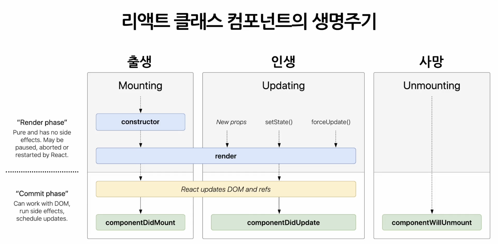

# 6강. State and Lifecycle
<br>

## State (상태)
React에서 state는 리액트 Component의 상태를 의미하며 여기서 상태란 React 컴포넌트의 변경 가능한 데이터라는 의미에 가까움. 이러한 state는 개발자가 정의해 사용하게 되며 state를 정의할 때 중요한 점은 꼭 렌더링이나 데이터 흐름에 사용되는 것만 state에 포함시켜야 한다는 것임. cuz... state가 변경될 경우, 컴포넌트가 재렌더링되기 때문에 렌더링과 데이터 흐름에 관련 없는 값을 포함하면 불필요한 경우에 컴포넌트가 다시 렌더링되어 성능을 저하시킬 수 있기 때문. => thus, 렌더링과 데이터 흐름에 관련 있는 값만 state에 포함되도록 해야 하며 그렇지 않은 값은 컴포넌트의 인스턴스 필드로 정의하면 됨.  <br>

리액트의 state는 JavaScript 객체.
<br>

```JavaScript
// 모든 클래스 컴포넌트에는 constructor(생성자)라는 이름의 함수가 존재하며 이는 클래스가 생성될 때 실행되는 함수임. 
class LikeButton extends REact.Component{
    constructor(props){
        super(props);

        this.state = { // 현재 컴포넌트의 state를 정의하는 부분
            like:false
        };
    }
    ...
    // 이렇게 정의한 state는 정의된 이후 직접 수정 할 수 없음. (엄밀히 말하면 수정은 가능하나 하면 안 됨.)
}

// Class Component의 경우, state를 생성자에서 정의
// Function Component의 경우, state를 useState라는 hook을 사용해서 정의 
```
<br><br>

### state 수정 방법

<b> state를 직접 수정 (잘못된 사용법) </b>

```JavaScript
this.state = {
    name : 'hee'
};
```
<br>
<b> setState 함수를 통한 수정 (정상적인 사용법) </b>

```JavaScript
this.setstate = {
    name : 'hee'
};
```
<br><br>

## Lifecycle (생명 주기)
<br>

리액트 Component의 생명 주기. 즉, 컴포넌트가 생성되는 시점과 사라지는 시점이 정해져 있다는 뜻. 
<br>



<br><br>

## 실습. state 사용하기
<br><br>

## 실습. ReactDeveloper Tools 사용하기
chrome에서 react developer tool 확장 프로그램 설치. 

<br><br>

## 실습. Lifecycle method 사용해보기
<br><br>
