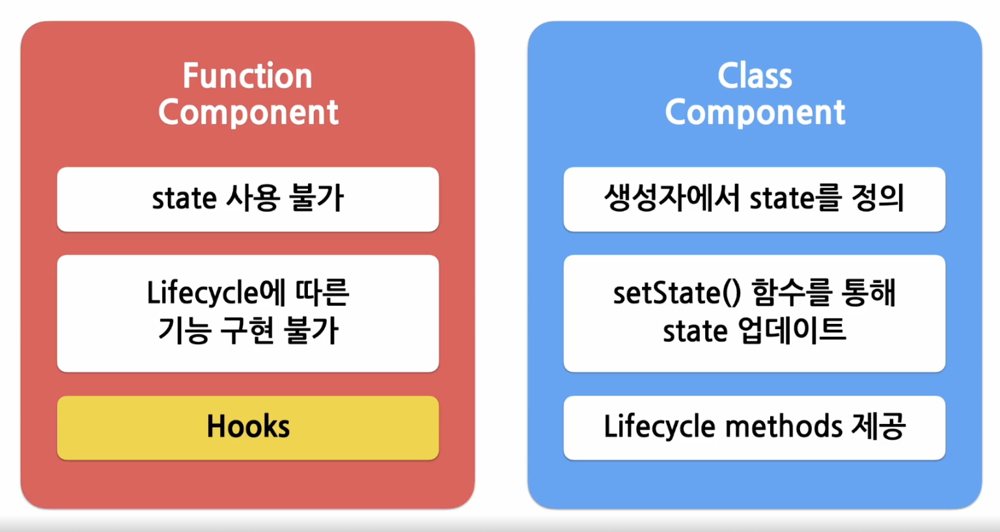

# 7강. Hooks
<br>

## Hooks
<br>



<br>

함수 컴포넌트는 클래스 컴포넌트와는 다르게 코드도 굉장히 간결하고 별도로 state를 정의해서 사용하거나 컴포넌트의 생명주기에 맞춰 어떤 코드가 실행되도록 할 수가 없었음 => 이런 기능을 지원하기 위해 나온 것이 <b>Hook.</b>
<br>
Hook을 사용하면 함수 컴포넌트도 클래스 컴포넌트의 기능을 모두 동일하게 구현할 수 있게 됨. <br>

<b> Hook (갈고리) </b> : 원래 존재하는 어떤 기능에 마치 갈고리를 거는 것처럼 끼어 들어가 같이 수행되는 것을 의미.<br>

*Hook의 이름은 모두 use로 시작!!<br>
*Hook이 수행하는 기능에 따라서 이름을 짓게 되었는데 각 기능을 사용하겠다는 의미로 use를 앞에 붙임. <br><br>

## useState()
<br>
state를 사용하기 위한 Hook<br>

```JavaScript
import React, {useState} from "react";

function Counter(props){
    var count = 0;

    return (
        <div>
            <p> clicked total {count}. </p>
            <button onClick={() => count ++}>
                click!
            </button>
        </div>
    ); 
}
```
<br><br>

### useState() 사용법
<br>

```JavaScript
const [변수명, set함수명] = useState(초기값);
// 클래스 컴포넌트의 생성자에서 state를 선언할 때 초기값을 넣어주는 것과 동일한 것. 
// 초기값을 넣어 useState를 노출하면 return값으로 배열이 나옴.
// return된 배열에는 두 가지 항목이 들어있는데 첫 번째 항목은 state로 선언된 변수, 두 번째 항목은 해당 state의 set 함수. 
```
<br>

```JavaScript
import React, {useState} from "react";

function Counter(props){

    // state의 변수명 = count, set함수 = setCount
    const [count, setCount] = useStae(0);

    // 버튼이 눌렸을 때 setCount 함수를 호출해서 카운트를 1 증가시킴. 카운트 값이 변경되면 컴포넌트가 재렌더링되면서 화면에 새로운 카운트 값이 표시됨. 
    return (
        <div>
            <p> clicked total {count}. </p>
            <button onClick={() => setCount(count+1)}>
                click!
            </button>
        </div>
    ); 
}
```
<br><br>

## useEffect()
<br>
Side effect를 수행하기 위한 Hook<br>
리액트의 함수 컴포넌트에서 Side effect를 실행할 수 있게 해주는 Hook.
<br>
클래스 컴포넌트에서 제공하는 생명 주기 함수인 componentDidMount, componentDidUpdate, componentWillUpmount와 동일한 기능을 하나로 통합해서 제공함. => useEffect 훅만으로 이러한 생명 주기 함수와 동일한 기능 수행 가능. 
<br><br>


### Side effect (부작용)
<br>

개발자가 의도치 않은 코드가 실행되면서 버그가 나타나면 사이드 이펙트가 나타났다고 함. <br>
BUT 리엑트에서의 사이드 이펙트는 효과, 영향에 더 가까움. <br>
ex) 서버에서 데이터를 받아오거나 수동으로 DOM을 변경하는 등의 작업을 의미. 이런 작업을 이펙트라고 부르는 이유는 이 작업들이 다른 컴포넌트에 영향을 미칠 수 있으며, 렌덜이 중에는 작업이 완료될 수 없기 때문...<br>
=> thus 이러한 작업들이 사이드로 실행된다는 의미에서 사이드 이펙트라고 불림. 

<br><br>

### useEffect() 사용법
<br>

```JavaScript
// 의존성 배열은 말 그대로 이 이펙트가 의존하고 있는 배열인데 배열 안에 있는 변수 중에 하나라도 값이 변경되었을 때 이펙트 함수가 실행됨. 기본적으로 이펙트 함수는 처음 컴포넌트가 렌더링된 이후와 업데이트로 인한 재렌더링 이후에 실행됨. 

useEffect(이펙트 함수, 의존성 배열);
```
<br>

```JavaScript
// 만약, Effect function이 mount와 unmount 시에 단 한 번씩만 실행하게 하고 싶으면 아래와 같이 의존성 배열에 빈 배열을 넣으면 됨. 이렇게 하면 해당 이펙트가 props나 state에 있는 어떤 값에도 의존하지 않는 것이 되므로 여러 번 실행되지 X.
useEffect(이펙트 함수, []);
```
<br>

```JavaScript
// 의존성 배열은 생각할 수도 있는데 생략하면 컴포넌트가 업데이트될 때마다 호출됨. 
useEffect(이펙트 함수);
```

<br><br>

```JavaScript
//useEffect 안에 있는 effect 함수에서는 브라우저에서 제공하는 API를 사용해서 도큐멘트의 타이틀을 업데이트함. 
import React, {useState, useEffect} from "react";

// 이 코드처럼 의존성 배열 없이 useEffect를 사용하면 React는 DOM이 변경된 이후에 해당 이펙트 함수를 실행하라는 의미로 받아들임. => thus 기본적으로 컴포넌트가 처음 렌더링 될 때를 포함해서 매번 렌더링 될 때마다 이펙트가 실행된다고 보면 됨. 
function Counter(props){
    const [count, setCount] = useStae(0);

    // componentDidMount, conponentDidUpdate와 비슷하게 작동함. 
    useEffect(() => {
        //useEffect 안에 있는 effect 함수에서는 브라우저에서 제공하는 API를 사용해서 도큐멘트의 title을 업데이트함. 
        document.title = `You clicked ${count} times`;
    });

    return(
        <div>
            <p> clicked total {count}. </p>
            <button onClick={() => setCount(count+1)}>
                click!
            </button>
        </div>
    )
}
```

<br><br>

> 7분 37초 부터... 코드 작성 안함...

<br>

```JavaScript
useEffect(() => {
    // 컴포넌트가 마운트 된 이후, 
    // 의존성 배열에 있는 변수들 중 하나라도 값이 변경되었을 대 실행됨
    // 의존성 배열에 빈 배열 ([])을 넣으면 마운트와 언마운트 시에 단 한 번씩만 실행됨
    // 의존성 배열 생략 시 컴포넌트 업데이트 시마다 실행됨
    ...

    return () => {
        // 컴포넌트가 마운트 해제되기 전에 실행됨
        ...
    }
}, [의존성 변수1, 의존성 변수2, ...]);
```
<br>